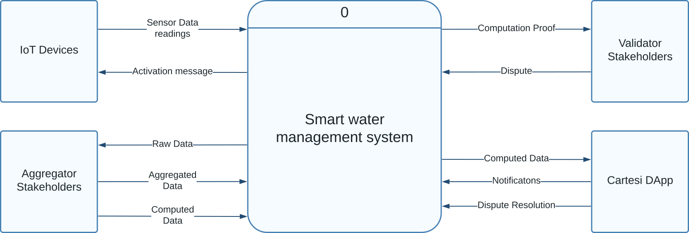
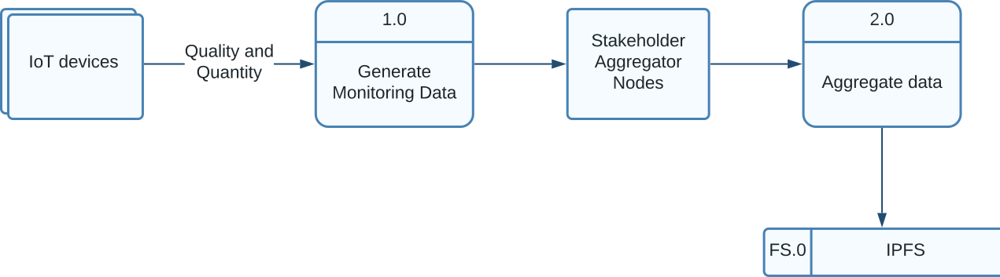
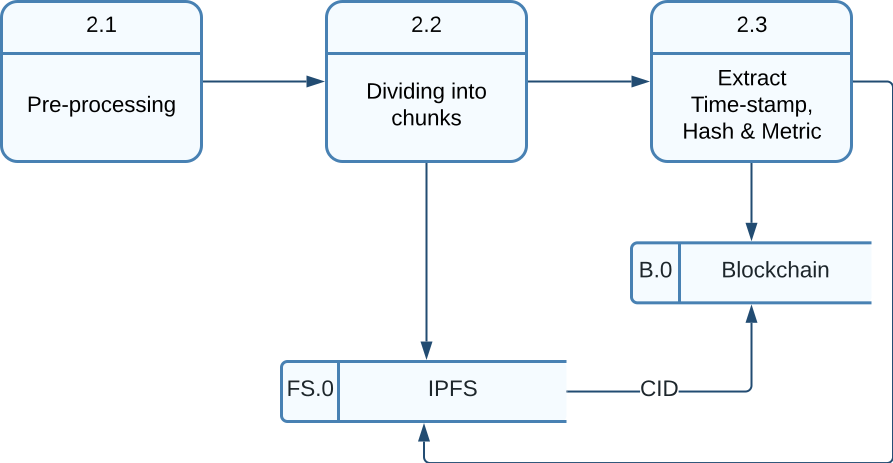
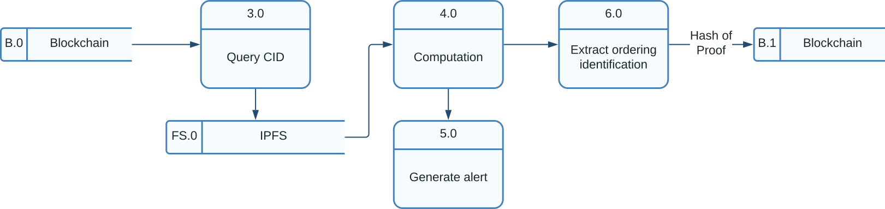
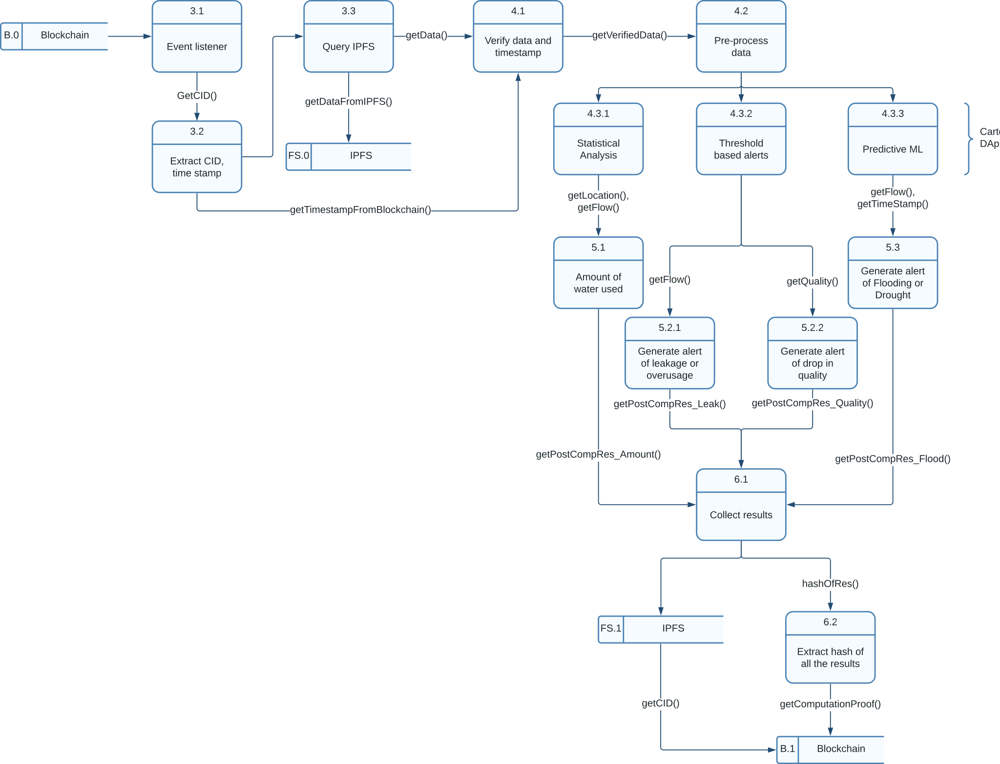

# Data Flow Diagrams - README

The `dataFlowDiagrams` directory contains a collection of Data Flow Diagrams (DFDs) and associated files that depict the flow of data within various systems and processes related to the project.

## Files and Descriptions:

### 1. **Context-Level Data Flow Diagram**

- **File**: `context-level-data-flow-diagram.svg`
- **Description**: This diagram provides a high-level overview of the system, illustrating how the system interacts with external entities.

### 2. **Stakeholder Aggregator - Level 0**

- **File**: `stakeholder-aggregator-level-0.svg`
- **Description**: A level-0 DFD representing the general flow of data within the stakeholder aggregator system.
- [Aggregator REPO](https://github.com/BlockOasis/stakeholderAggregator)

### 3. **Stakeholder Aggregator - Level 1**

- **File**: `stakeholder-aggregator-level-1.svg`
- **Description**: A more detailed (level-1) DFD expanding on specific functionalities of the stakeholder aggregator system.
- [Aggregator REPO](https://github.com/BlockOasis/stakeholderAggregator)

### 4. **Stakeholder Computer - Level 0**

- **File**: `stakeholder-computer-level-0.svg`
- **Description**: A level-0 DFD outlining the primary flow of data within the stakeholder computer system.
- [Computer REPO](https://github.com/BlockOasis/stakeholderAggregator)

### 5. **Stakeholder Computer - Level 1**

- **File**: `stakeholder-computer-level-1.svg`
- **Description**: A deeper dive (level-1) into the functionalities of the stakeholder computer system, capturing finer data flow details.
- [Computer REPO](https://github.com/BlockOasis/stakeholderAggregator)

---

Please consult the individual diagrams for detailed insights into each process and flow. Understanding these DFDs will provide a clearer picture of the data pathways and system interactions.
